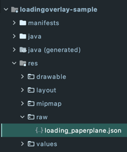

# LoadingOverlay
[](https://bintray.com/mohamedabulgasem/maven/loadingoverlay/0.0.1/link)

  - [Introduction](#introduction)
  - [Requirements](#requirements)
  - [Getting Started](#getting-started)
    - [Declaring Dependency](#declaring-dependency)
  - [Usage](#usage)
  - [Customisation](#customisation)
    - [Set `LoadingAnimation`](#set-loadinganimation)
      - [Builtin `LoadingAnimation` Views](#builtin-loadinganimation-views)
        - [Change Default Dimensions](#change-default-dimensions)
      - [Use a Lottie Animation File](#use-a-lottie-animation-file)
    - [Set Dim Amount](#set-dim-amount)
    - [Other Configuration Options](#other-configuration-options)
  - [License](#license)

## Introduction
A customisable loading overlay that leverages
[Lottie](https://github.com/airbnb/lottie-android) under the hood.

// 3 GIFs here

## Requirements

- AndroidX Compatibility

## Getting Started

### Declaring Dependency

Add the dependency to your app or module `build.gradle` file:

```gradle
dependencies {
    implementation 'com.mohamedabulgasem:loadingoverlay:0.0.1'
}
```

## Usage

Use LoadingOverlay `with` factory function to construct the loading
overlay then show and dismiss it:

```kotlin
private val loadingOverlay: LoadingOverlay by lazy {
    // Pass activity reference.
    LoadingOverlay.with(context)
}

// ...

fun onCreateNewAccountButtonClicked() {
    loadingOverlay.show()
    // Do loading work and then dismiss the loading overlay.
    loadingOverlay.dismiss()
}
```

## Customisation

Customisation options:

### Set `LoadingAnimation`

Either use one of the builtin `LoadingAnimation` views or set your own
from a lottie animation file:

#### Builtin `LoadingAnimation` Views

Use one of the 3 available builtin `LoadingAnimation` views:

- PROGRESS_BAR
```kotlin
LoadingOverlay.with(
    context = this,
    animation = LoadingAnimation.PROGRESS_BAR
)
```

- LOADING_SPINNER
```kotlin
LoadingOverlay.with(
    context = this,
    animation = LoadingAnimation.LOADING_SPINNER
)
```

- FADING_PROGRESS
```kotlin
LoadingOverlay.with(
    context = this,
    animation = LoadingAnimation.FADING_PROGRESS
)
```

##### Change Default Dimensions

You can use the `withDimens` function to change the default dimensions
(width and height) of the builtin `LoadingAnimation` view.

For example, LOADING_SPINNER default dimens value is `70dp`, we can
change that to `100dp`:

```kotlin
LoadingOverlay.with(
    context = this,
    animation = LoadingAnimation.LOADING_SPINNER.withDimens(100)
)
```

// Insert GIF here

#### Use a Lottie Animation File

Store a lottie animation file (json or zip) in your `raw` directory.



Construct the `LoadingAnimation` view with your lottie animation file
and set the dimensions (width and height) of the `LoadingAnimation`
view, specified in dp.

```kotlin
LoadingOverlay.with(
    context = this,
    animation = LoadingAnimation(
        rawRes = R.raw.loading_paperplane,
        dimens = 100
    )
)
```

// Insert GIF here

> LoadingOverlay uses `LoadingAnimation.PROGRESS_BAR` (Regular OS
> `ProgressBar` widget) by default - in case no `LoadingAnimation` is
> passed through the factory function.

> You can browse [lottiefiles.com](https://lottiefiles.com) for hundreds
> of lottie loading animation files from which you can download and use
> in your project or use your own
> [Adobe After Effects](http://www.adobe.com/products/aftereffects.html)
> animations which can be exported to json with the
> [Bodymovin](https://github.com/airbnb/lottie-web) plugin.

### Set Dim Amount

Set the amount of background dim, from 0.0 for no dim to 1.0 for full
dim:

```kotlin
LoadingOverlay.with(
    context = this,
    dimAmount = 0.3f
)
```

// Insert GIF here

```kotlin
LoadingOverlay.with(
    context = this,
    dimAmount = 0.7f
)
```

// Insert GIF here

> Default dim amount is `0.5f`

### Other Configuration Options

```kotlin
LoadingOverlay.with(
    context = this,
    
    // Specify whether the overlay is cancelable on 
    // back presses or screen touches, default is false.
    isCancellable = true,
    
    onShowListener = {
        // Optionally run some code when the overlay is shown.
    },
    
    onCancelListener = {
        // Optionally run some code if isCancellable 
        // is set to true and the overlay is cancelled.
    },
    
    onDismissListener = {
        // Optionally run some code when the overlay is dismissed.
    }
)
```

## License

    Copyright 2020 Mohamed Abulgasem

    Licensed under the Apache License, Version 2.0 (the "License");
    you may not use this file except in compliance with the License.
    You may obtain a copy of the License at

       http://www.apache.org/licenses/LICENSE-2.0

    Unless required by applicable law or agreed to in writing, software
    distributed under the License is distributed on an "AS IS" BASIS,
    WITHOUT WARRANTIES OR CONDITIONS OF ANY KIND, either express or implied.
    See the License for the specific language governing permissions and
    limitations under the License.
